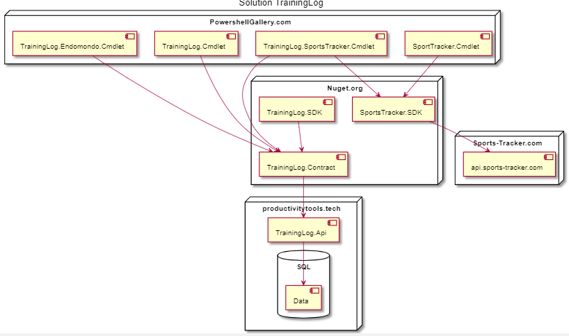

Training Log is group of applications which helps to manage your sport activities. 
Here you can find the list of the projects which it contain [Organization](https://github.com/ProductivityTools-TrainingLog)

# Projects

## [TrainingLog.Api](https://github.com/ProductivityTools-TrainingLog/ProductivityTools.TrainingLog.Api)
API exposes all trainings. It should be treated as private backup of all gpx, images, and manual trainings.

## [TrainingLog.Contract](https://github.com/ProductivityTools-TrainingLog/ProductivityTools.TrainingLog.Contract)
DTO's exposed by TrainingLog.Api. 

## TrainingLog.Cmdlet
Module doesn't exist maybe in the future I will create it to add trainings directly to the api

## [TrainingLog.Endomondo.Cmdlet](https://github.com/ProductivityTools-TrainingLog/ProductivityTools.TrainingLog.Endomondo)
Module which allows to import Trainings from Endomondo backup to TraingLog.Api.

## [TrainingLog.SportsTracker.Cmdlet](https://github.com/ProductivityTools-TrainingLog/ProductivityTools.TrainingLog.SportsTracker)
Module allows to import data from TrainingLog to SportsTracker and import from SportsTracker to TrainingLog.

## [SportsTracker.Cmdlet](https://github.com/ProductivityTools-TrainingLog/ProductivityTools.SportsTracker.Cmdlet)
Cmdlet allows to add trainings to https://sports-tracker.com/ website. It uses SportsTracker.SDK.

## [SportsTracker.SDK](https://github.com/ProductivityTools-TrainingLog/ProductivityTools.SportsTracker.SDK)
Library exposes methods which allow to manage trainings on the https://sports-tracker.com/ website.

# Training Log solution architecture

