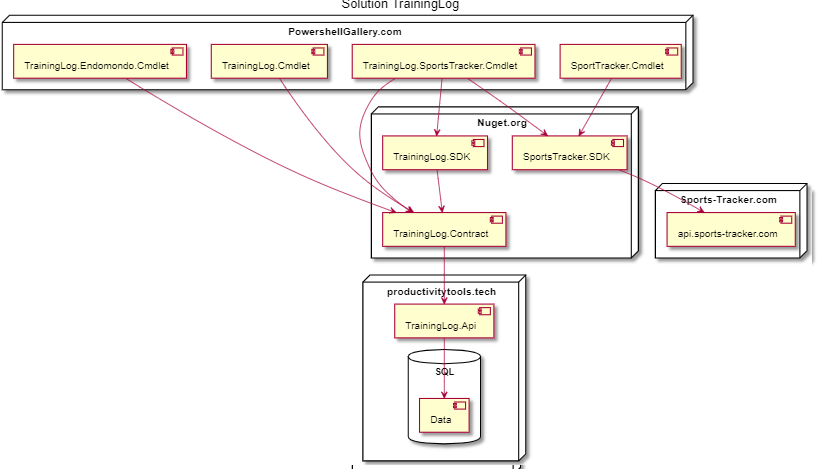

## Training Log is group of applications which helps to manage your sport activities. 
Here you can find the list of the projects which it contain [Organization](https://github.com/ProductivityTools-TrainingLog)

# Projects
## [SportsTracker.SDK](https://github.com/ProductivityTools-TrainingLog/ProductivityTools.SportsTracker.SDK)
Library exposes methods which allow to manage trainings on the https://sports-tracker.com/ website.

## SportsTracker.Cmdlet

## Training Log solution architecture

